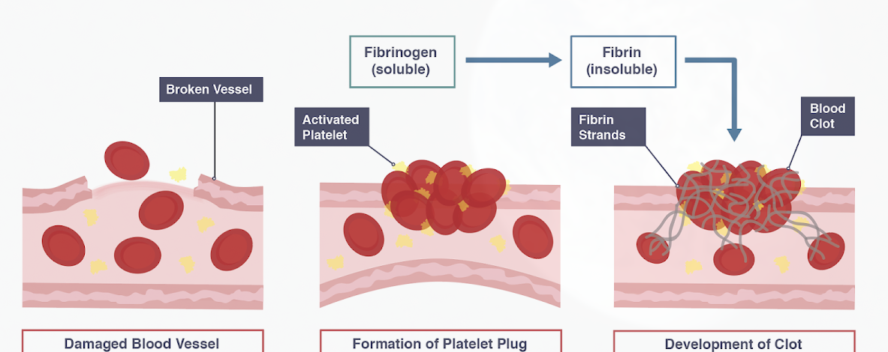

# Microbiology
## Defence mechanisms of the body

The body is very good at preventing most microorganisms from gaining entry and effectively defending itself against those microorganisms that do enter.

 - The skin is an excellent physical barrier between the body and the surrounding external environment. It stops most pathogenic microbes from entering.
 - Mucous membranes line the respiratory system. They secrete mucus which traps microorganisms and stops them going any further. The mucus and trapped material are then moved by cilia to the throat where they are swallowed and then pass out of the body harmlessly
 - Blood clotting seal wounds and act as a barrier against infection. Platelets play a role in converting the soluble protein fibrinogen (found in blood plasma) to fibrin. Fibrin is an insoluble protein that forms fibres. The fibres form a mesh across the wound. Red blood cells and other cells get trapped in a tangle of fibrin threads, forming a blood clot. Blood clot formation is followed by scab formation.

### Defence against microorganisms that have entered the body
White blood cells defend the body against disease. There are two typed of white blood cells: Lymphocytes and Phagocytes. Lymphocytes produce antibodies while Phagocytes engulf and digest microorganisms.

1. Invading microorganisms have antigens on their surface that the human body can recognise as being foreign
2. When the body recognises a foreign antigenm lymphocytes produce antibodies that are complimentary in shape to the antigen. 
3. Antibodies immobilise microorganisms by clumping them together.
4. Immobilisation of the microorganisms stops it reproducing and prevents the spread of infection
5. The clump of microorganisms is then destroyed by phagocytosis
