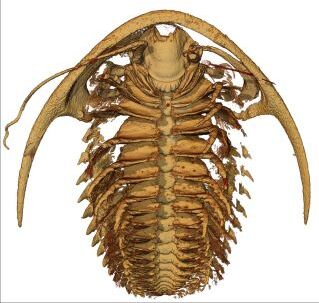
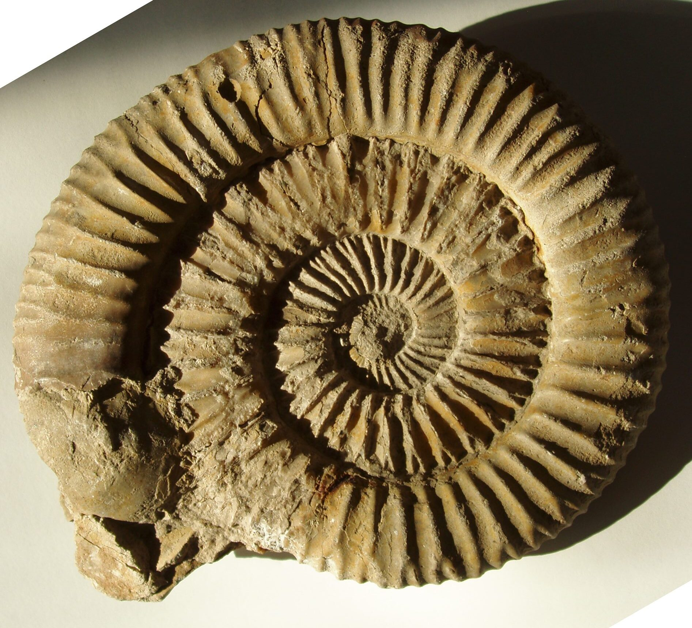

# Geology 

## Fossils

A fossil is the preserved remains or traces of a dead organism. The process by which a fossil is formed is called fossilisation. It's very rare for living things to become fossilised. Usually after most animals die their bodies just rot away and nothing is left behind. However, under certain special conditions, a fossil can form. After an animal dies, the soft parts of its boy decompose, leaving the heard parts, like the skeleton, behind. This becomes buried by small particles of rock called sediment. As more layers of sediment build up on top, the sediment around the skeleton begins to compact and turn to rock. The bones then start to be dissolved by water seeping through the rock. Minerals in the water replace the bone, leaving a rock replica of the original bone called a fossil.

|Fossil|Image|Description|
|A Trilobite|| - Ancient marine animal - Lived hundreds of millions of years - Hard segmented bodies with 3 sections - Found all over Earth - Helps scientists understand Earth's history|
|An Ammonite|| - Sea creature with coiled shells, related to squids and octopi - Lived for millions of years before going extinct with the dinosaurs - Often "beautifully" patterned - Popular with collectors and paleontologists|

## Igneous rock
This forms when rock melts, then cools and hardens again. All igneous rocks contain crystals which were formed as lava (molten rock on the earth's surface) or magma (molten rock trapped in the earth's crust) cooled and hardened.

|Intrusive igneous rock|&nbsp;|Extrusive igneous rock|
|:-|:-|:-|
|Magma|formed from|lava|
|inside the earth|where|surface|
|slowly|rate of cooling|quickly|
|large|size of crystals|small|
|coarse|texture|fine|
|Granite|example|Basalt|

Lava = Magma but on surface

|Rock|Description|
|:-|:-|
|Granite| - Very hard, used for building stone - Made of different crystals and minerals e.g. feldspar, mica, quarts - intrusive|
|Gabbro| - Feldspar, olivine - Coarse-grained - Intrusive|
|Basalt| - Fine-grained - Extrusive|
|Obsidian| - Very dark and glassy - Forms in volcanoes - Extrusive|

## Metamorphic rock

Deep underground, its hot and the pressure can be enormous. It can change the rock without melting it. Metamorphic rock is a compositie type. It cannot be made from scratch. It uses either a sedimentary rock or an igneous rock to pressurise and heat to become a new rock.
